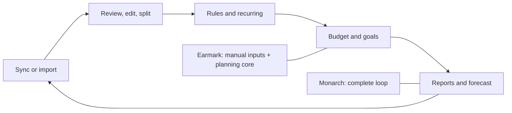

# Earmark vs. Monarch

**Assessed:** 2026-09-17  
**Earmark revision:** `a29991f`

## Verdict

Earmark is not yet an open-source Monarch alternative. It shares Monarch's household-finance nouns, but today it is a manual, early-stage planner. Monarch's moat is the automated operating loop: connected data, review and rules, recurring detection, goals, reporting, forecasting, and mature multi-device delivery. Earmark's clearest wedge is narrower: an auditable, self-hostable, Canada-first household wealth plan that keeps investable assets, home equity, and a future-home fund distinct.

## Capability gap

| Area | Earmark now | Monarch now | Assessment |
|---|---|---|---|
| Account aggregation | Manual account creation | 13,000+ institutions through Plaid, MX, and Mastercard Data Connect; manual import fallback | Decisive Monarch lead |
| Transactions | Manual create, recent 100, payee suggestions, paired transfers | Search, filters, review queues, edits, rules, smart splits, receipt capture, activity log | Decisive Monarch lead |
| Budgeting | Monthly buckets, obligations, rollover calculations, category creation | Flex and category budgets, forecasts, rollovers, non-monthly planning | Same category; Earmark is much earlier |
| Goals | Target gap appears on dashboard; no complete goal workflow | Save-up and pay-down goals, linked accounts, transaction allocation, APR/payoff strategies | Large gap |
| Net worth | Manual positions and valuations; investable and total views | Synced history, filtering, property, investments, loans, crypto | Earmark has a better conceptual split; Monarch has automation/history |
| Forecasting | Deterministic contribution phases, windfall, inflation target, 5/7/9% sensitivities | Plus: actual-account projections, taxes, debt, withdrawals, life events, scenario comparison | Earmark is more transparent; Monarch is broader |
| Reports | Dashboard summary only | Cash flow, spending, income, Sankey, trends, pies, treemap, drilldown, saved/exportable reports | Major gap |
| Recurring cash flow | None | Detected subscriptions and bills, calendars and recurring views | Major gap |
| Investments | Balances only through financial positions | Holdings, allocation, performance, advanced analysis | Major gap |
| Collaboration | Household members, invitations, roles | Partner/advisor invites, transaction review, shared views | Useful foundation; large workflow gap |
| Platforms | Responsive web app | Web, iPhone, iPad, Android, browser extension | Monarch lead |
| Security/trust | Fortify auth, email verification, TOTP, passkeys | Read-only bank permissions, MFA, encryption, SOC 2 controls | Earmark has good auth primitives; lacks production trust surface |
| Canada | Ontario-oriented product context but no currency or registered-account model | Canada supported; billed in USD; some institution-connection limitations | Best available differentiation remains unbuilt |
| Open source | Public repo; `composer.json` says MIT; no root licence file and GitHub detects no licence | Proprietary subscription | Fix immediately: add an explicit root `LICENSE` |

## What the UI evidence says

| Journey | Monarch pattern seen in Mobbin | Earmark implication |
|---|---|---|
| Onboarding | [28-screen guided setup](https://mobbin.com/flows/e12ffc88-2d1f-4cc5-96dd-97761b730c5e) and [institution-first account connection](https://mobbin.com/flows/60449d28-6d92-4d15-8f92-81a1e98f2c3e) | Make first value come from a CSV import before adding more dashboard cards |
| Dashboard | [Modular overview](https://mobbin.com/screens/71d955e4-fe39-4a95-a201-82f8434dc273) spanning budget, recent transactions, recurring, net worth, goals, and investments | Preserve Earmark's smaller overview until downstream workflows exist |
| Transactions | [Dedicated review/filter workflow](https://mobbin.com/flows/0de89f8c-5f2f-4725-b008-a67714c22168) with a [high-density filter surface](https://mobbin.com/screens/25ee586f-f702-483f-8562-6b9b1b09c636) | This should be the next operational centre |
| Budget | [Table-based budget](https://mobbin.com/screens/b969264a-832b-4872-8aa6-8b42603629f3) plus [forward forecast](https://mobbin.com/screens/80e9c025-a963-4312-a4c3-9ce1909d256b) | Connect buckets to transactions before deepening the visual design |
| Goals | [Goal creation](https://mobbin.com/flows/37575b99-803c-4a56-a54c-ac1661236ffd), details, and [account assignment](https://mobbin.com/screens/c88d2a01-efe1-46b3-8472-436b34d14706) | Treat home purchase and retirement as funded plans, not dashboard numbers |
| Reporting | [Cash-flow reports](https://mobbin.com/screens/a36680be-a37b-4106-bc2c-389964a31f88) and drilldown | Add reports only after transaction data is trustworthy |
| Recurring | [Monthly recurring view](https://mobbin.com/screens/81d43f42-9729-4a1a-a191-2d91e65f83f1) | Detection is more valuable than a static bills list |
| Investments | [Allocation](https://mobbin.com/screens/62f0db8d-db3f-4b1f-b51b-100d72a3e977) and [holdings](https://mobbin.com/screens/37b0330a-a415-4b48-a6ac-e6a5029a94e7) | Defer until imported balances and account types are reliable |

## Copy, differentiate, defer

| Priority | Product move | Reason |
|---:|---|---|
| 0 | Add a root MIT `LICENSE` | Public source without a licence does not grant normal reuse, modification, or distribution rights |
| 1 | Ship CSV import with mapping, preview, duplicate detection, and rollback | Creates a useful non-bank-sync path and activates the existing staging schema |
| 2 | Complete transaction search, edit, delete, split, review, rules, and reconciliation | Establishes the trustworthy data loop every other feature depends on |
| 3 | Connect categories and buckets to transaction assignment | Turns current budget calculations into an operating budget |
| 4 | Add recurring detection, cash-flow reports, and export/backup | Makes the product useful between planning sessions |
| 5 | Build Canada-first planning: CAD/multi-currency, TFSA, RRSP, FHSA, HBP repayment, CPP/OAS, and tax-aware scenarios | Credible differentiation from Monarch for the target household |
| 6 | Add transparent assumptions, explainable formulas, versioned scenarios, and self-hosting docs | Makes “auditable and self-hostable” a product promise |
| Later | Native apps, AI assistant, business P&L, estate tools, deep investment analytics, live bank sync | Expensive parity work with weak early differentiation |

## Positioning test

| Element | Candidate |
|---|---|
| Category | Self-hosted household finance and wealth planning |
| Best-fit customer | Canadian couples who want shared cash-flow control and a transparent long-term plan |
| Alternative | Monarch, YNAB plus spreadsheets, bank dashboards, or a custom spreadsheet |
| Differentiated value | Household data ownership; auditable projections; Canada-specific accounts and rules; home equity kept separate from investable retirement assets |
| Comprehension test | “Would a Canadian couple understand why this is better for them than Monarch within ten seconds?” |

## Decision standards

| Standard | Application |
|---|---|
| OA-011 | Compare against the customer's real alternatives, including spreadsheets, bank portals, and inaction—not Monarch alone |
| GTMO-009 | Treat generic dashboards, budgets, and transaction lists as commodity; differentiate through data ownership, auditability, and Canadian planning |
| GTMO-015 | Anchor any future paid offer to avoided planning/admin cost and the value of household clarity, not Monarch's feature count |
| GTMS-016 | Position from alternatives and differentiated value rather than calling Earmark “open-source Monarch” |
| OA-005 | Test whether the Canada-first promise is immediately understood before expanding the feature surface |
| OA-013 | Prioritise the alternatives customers actually choose at decision time |

## Primary sources

| Topic | Source |
|---|---|
| Pricing and tier scope | [Monarch pricing](https://www.monarch.com/pricing), [Monarch Plus](https://help.monarch.com/hc/en-us/articles/48349699981972-Monarch-Plus-Tier) |
| Tracking and account connectivity | [Tracking](https://www.monarch.com/features/tracking), [connecting accounts](https://help.monarch.com/hc/en-us/articles/360048393352-Guide-to-Connecting-Your-Accounts) |
| Budget and goals | [Budgeting](https://www.monarch.com/features/budgeting), [Goals 3.0](https://help.monarch.com/hc/en-us/articles/44373110771860-Introducing-Goals-3-0) |
| Collaboration | [Monarch for couples](https://www.monarch.com/for-couples), [Shared Views](https://help.monarch.com/hc/en-us/articles/42228648365076-Shared-Views-in-Monarch) |
| Transactions | [Transaction rules](https://help.monarch.com/hc/en-us/articles/360048393372-Transaction-Rules), [reviewing transactions](https://help.monarch.com/hc/en-us/articles/5528707082516-Reviewing-Transactions) |
| Reports and forecasting | [Reports](https://help.monarch.com/hc/en-us/articles/21846787088916-Using-Reports), [forecasting](https://help.monarch.com/hc/en-us/articles/48344305092244-Forecasting-in-Monarch) |
| Canada, platforms, security, AI | [Canada](https://www.monarch.com/canada), [downloads](https://www.monarch.com/download), [security](https://www.monarch.com/security), [AI features](https://help.monarch.com/hc/en-us/articles/16116906962452-About-Monarch-s-AI-Features) |
| Product recency | [What's new](https://www.monarch.com/whats-new) |
| Open-source licence requirement | [GitHub licensing guidance](https://docs.github.com/en/repositories/managing-your-repositorys-settings-and-features/customizing-your-repository/licensing-a-repository) |

## Bottom line

Do not chase parity. First make Earmark's manual-data loop complete; then earn a distinct position through Canadian household planning and inspectable calculations. The projection is a good seed, but Monarch Plus now forecasts retirement and life events, so the durable edge must be ownership, clarity, and jurisdiction-specific depth.
